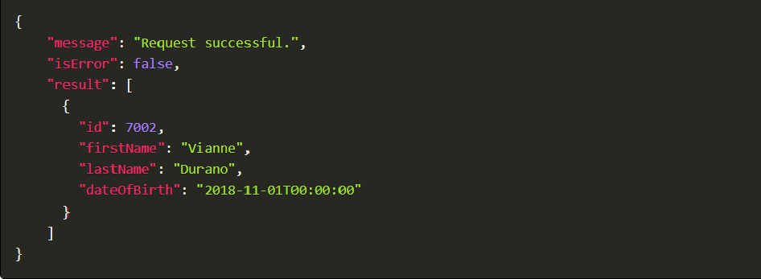
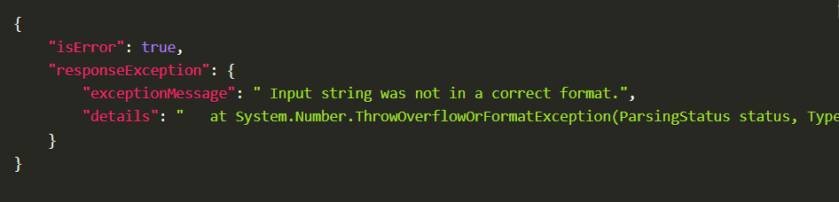

# AutoWrapper in ASP.NET Core

## What is AutoWrapper?
[AutoWrapper](https://vmsdurano.com/asp-net-core-with-autowrapper-customizing-the-default-response-output/) is **a simple customizable global exception handler and response wrapper for ASP.NET Core APIs**. It uses middleware to **intercept incoming HTTP requests and automatically wraps the responses** by providing a consistent response format for both successful and error results. 

**AutoWrapper is a project fork based on VMD.RESTApiResponseWrapper.Corewhich** is designed to support .NET Core 3.x and above. The implementation of this package was refactored to provide **a more convenient way to use the middleware** with added flexibility.

## Why AutoWrapper?
When building APIs for “real” application projects, most developers forgot about the importance of providing a meaningful response to their consumers. There are a few reasons why this can happen; could be that their development time is limited, they don't have a standard format for HTTP response or simply they just don't care about the response for as long as the API will return needed data to the consumer. Well, API’s is not just about passing JSON back and forth over HTTP, but it’s also how you present meaningful responses to the developers who consume it.


## Main Features:
* **Exception handling**
* **ModelState validation** error handling (support both Data Annotation and FluentValidation)
* **Configurable API exception**
* **The consistent response format** for the Result and Errors
* **Detailed Result response**
* **Detailed Error response**
* **Configurable HTTP status codes and messages**
* Add **support for Swagger**
* Add **Logging support** for Requests, Response and Exceptions
* Add **options in the middleware** to set ApiVersion and IsDebug properties

## About this exercise

Previously we scaffolded a new Angular application in which we have integrated

* **Scaffolded the angular application**
* **FontAwesome Library** for icons
* **Bootstrap Library** for styling buttons
* **Bootstrap NavBar** component
* We have **multiple components** e.g. (CreateAccountComponent,   ManageAccountsComponent, DepositFundsComponent, TransferFundsComponent) in our application for which we have already **configured routing**.
* **SideNav has links** that are navigated to these components.
* We developed a **base structure of an API solution in Asp.net core** that have just two API functions **GetLast12MonthBalances** and **GetLast12MonthBalances/{userId}** which returns data of the last 12 months' total balances.
* There is an **authorization service with two functions Login & Logout**. The login function is setting up hardcoded user properties (Name, Email, Roles) and storing them in local storage whereas the logout function is removing that user object from local storage.
* **Links on the side nav are shown or hidden based** on the logged-in user's role
* We also have **a toolbar that shows Logged in User's Name**.

## In this exercise

 * We will implement **AutoWrapper in BBankAPI Project** 
 * We will **handle the uniform response** in Angular.


 Here are the steps to begin with 

# Server Side Implementation 

## Step 1: Install Nuget Package

To start working on the AutoWrapper we will **first install the AutoWrapper.Core library** using the command given below in the package manager consol:
```
Install-Package AutoWrapper.Core -Version 2.0.1
```


##  Step 2: Register the AutoWrapper in Middleware

We will create  `UseApiResponseAndExceptionWrapper` in `program.cs` file to register the middleware as below :

```cs
app.UseApiResponseAndExceptionWrapper();
```

##  Step 3: Change Action Response

To implement the uniform response we will change the `Task<ActionResult>` return type to `Task<ApiResponse>` in `TransactionController` Actions.

In case of a successful response, we will return the `ApiResponse` class object whereas in case of an error we will return the `ApiException` class object.

Here is the code below : 

```cs
[HttpGet]
[Route("GetLast12MonthBalances")]
public async Task<ApiResponse> GetLast12MonthBalances()
{
  try
  {
    var res = await _transactionService.GetLast12MonthBalances(null);
    return new ApiResponse("Last 12 Month Balances Returned.", res);
  }
  catch (Exception ex)
  {
    throw new ApiException(ex);
  }
}
```

That's it on the server-side implementation, Run the API and see it working as below :


# Client Side Implementation 

##  Step 1: Implement Uniform ApiResponse

We will **create a new folder model** under the app folder and then create a new file named `api-Response.ts` in which we will create an interface `ApiResponse` which will be used as a uniform response receiver from API. The `ApiResponse` will be inheriting the `ResponseException` interface and this interface will be inheriting an array of `ValidationError` an interface as below :

```ts
export interface ApiResponse {
    isError: boolean;
    message: string;
    responseException: ResponseException;
}
export interface ResponseException {
    exceptionMessage: string;
    validationErrors: ValidationError[]
}

export interface ValidationError {
    name: string;
    reason: string
}
```

## Step 2: Implement Line Graph Data Response

Go to the `line-graph-data.ts` file and here We will create a new interface `LineGraphDataResponse` which will be extending the `ApiResponse` interface. We will **use LineGraphDataResponse class for receiving uniform responses** specifically for `LineGraphData`. Add the necessary imports for the given interface 

```ts
export interface LineGraphDataResponse extends ApiResponse {
  result: LineGraphData
}
```

## Step 3: Update TransactionService Class

We will be replacing `LineGraphData` with `LineGraphDataResponse` in getLast12MonthBalances returned observable type as well as in `httpClient` get request. Also, add the necessary imports. The code is given below 

```ts
  getLast12MonthBalances(accountId?: string): Observable<LineGraphDataResponse> {
    if (accountId === null) {
      return this.httpClient.get<LineGraphDataResponse>(`${environment.apiUrlBase}Transaction/GetLast12MonthBalances`);
    }
    return this.httpClient.get<LineGraphDataResponse>(`${environment.apiUrlBase}Transaction/GetLast12MonthBalances/${accountId}`);
  }
```

## Step 4: Update Dashboard Component

Go to `DashboardComponent.ts` and set the received response in `lineGraphData` from `data.result`. Also, we will be using the `error.responseException.exceptionMessage` which will contain the error message if any

```ts
this.transactionService
      .getLast12MonthBalances('37846734-172e-4149-8cec-6f43d1eb3f60')
      .subscribe({
        next: (data) => {
          this.lineGraphData = data.result; // received response is in data.result object.
        },
        error: (error) => {
          console.log(error.responseException.exceptionMessage);
        },
      });
```

## Final Output
We have **implemented the AutoWrapper for the uniform response** from the APIs for both successful and exception responses. 

AutoWrapper will spit out the following **format on successful requests**:



AutoWrapper will spit out the following response **format when an exception has occurred**:


And if you set the **IsDebug property in the AutoWrapperOptions**, it will result in something like this with stack trace information:


